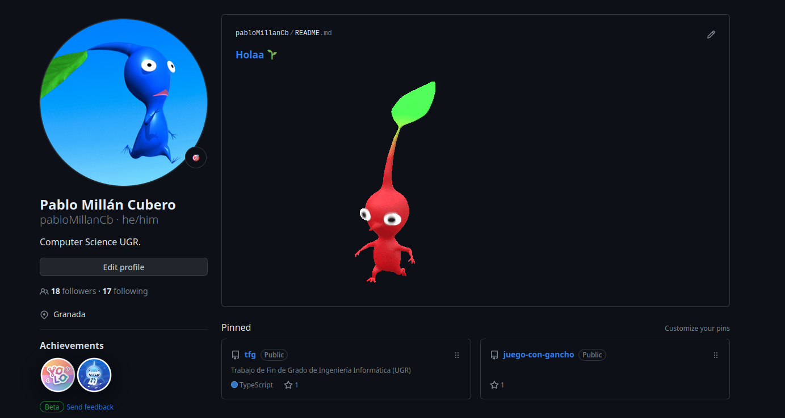
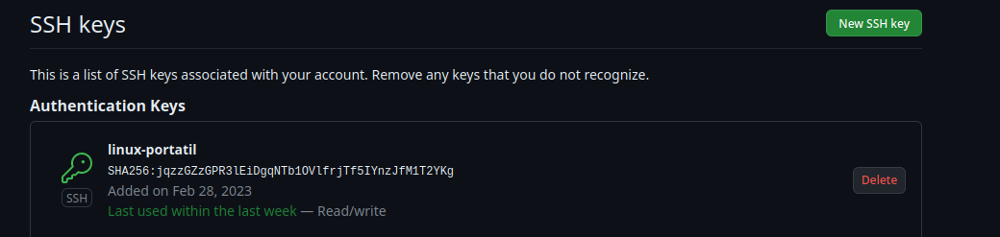
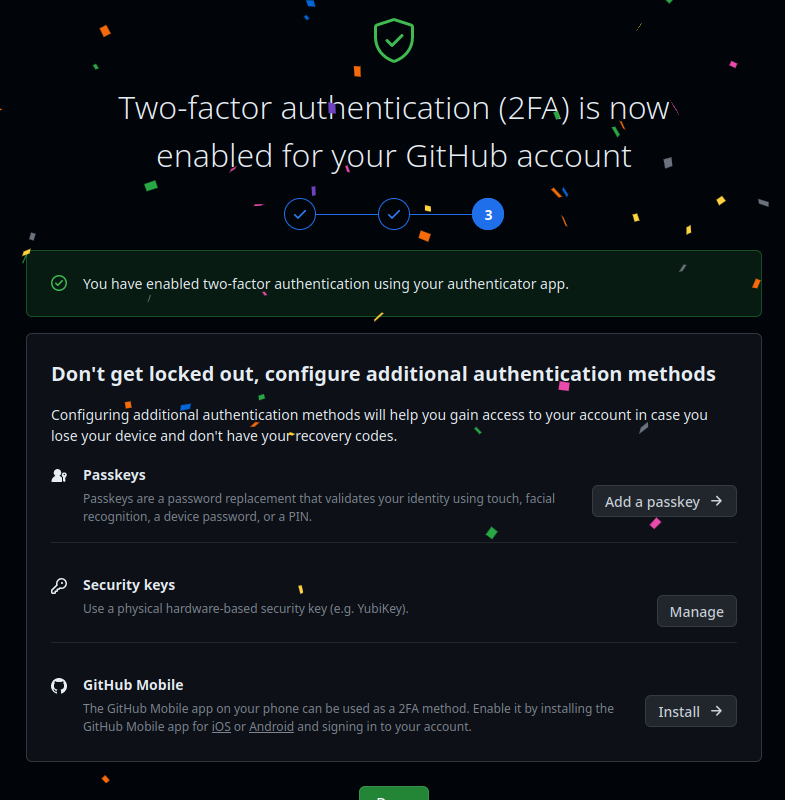

## Descripción del problema

Los juegos de rol son una actividad en la que varias personas se reunen para interpretar cada uno a un personaje en un mundo ficticio mientras que el *game master* o director de juego presenta un mundo y eventos en los cuales se verán envueltos dichos personajes. Estos deberán resolver las situaciones que se les propongan tirando dados y tomando decisiones.

En los últimos tiempos (y sobre todo desde la pandemia) se ha popularizado el jugar a juegos de rol de forma telemática, en lugar de reuniéndose todos alrededor de una mesa como puede ser habitual. Para facilitar la labor de jugar de esta forma se hace uso de los llamados *Virtual Tabletops* o *VTT*, entornos virtuales con funciones para llevar a cabo una partida, como podría ser almacenar y gestionar la información de las fichas de personaje, tirar y sumar dados de forma automática, mostrar imágenes y mapas a los jugadiores, etc. Algunos ejemplos son [Nivel20](https://nivel20.com/), [Roll20](https://roll20.net/) y [Owlbear Rodeo](https://www.owlbear.rodeo/). Estos entornos pueden ser *game agnostic* (es decir, genéricos para cualquier juego) o estar enfocados a uno como *Dungeons & Dragons*.

[*Seapunk Unleashed*](https://www.unleashedgames.es/seapunk-unleashed/), un juego de rol independiente escrito por [Pedro J. Paul](https://twitter.com/Pedro_J_Paul) pensado para vivir aventuras de fantasía pirata al estilo del manga de *One Piece*. No existe ninguna herramienta diseñada para jugar de forma online especificamente a este juego. Se puede usar un *VTT* agnóstico, pero tiene ciertas limitaciones. Un sistema agnóstico no puede almacenar o automatizar una ficha de personaje de *Seapunk Unleashed*, ya que cada juego es distinto y tiene sus particularidades. Esto se traduce en que los jugadores tendrían que acceder a su ficha de forma paralela (ya sea en PDF o en papel) y no podrían automatizar las operaciones aritméticas simples necesarias para jugar al juego.

### Lógica de negocio

Para solucionar este problema se propone el desarrollo de un *VTT* diseñado para jugar *Seapunk Unleashed* desde un navegador web. Los participantes se unirán a una sesión compartida, como si estuvieran en una mesa, en la que poder realizar sus tiradas de dados y gestionar sus fichas de personaje. Esto permitirá que el desarrollo de las partidas sea más cómodo tanto para los jugadores como para el director de juego.

### A quién beneficiaría

El producto beneficiaría a:
1. Personas interesadas en jugar *Seapunk Unleashed*, ya que tendrán un sitio en el que guardar información sobre su personaje, evitar realizar cuentas matemáticas y tirar dados en un espacio compartido donde todos pueden ver el resultado.

2. El director de juego, que requiere de funcionalidades específicas que faciliten su labor, ya que debe actuar como muchos personajes a la vez (seguimiento de varias fichas de forma simultánea) y presentar el mundo (compartir imágenes que acompañen a sus descripciones).

## Preparación inicial del entorno de trabajo

Para comenzar se realizó el [repositorio del proyecto](https://github.com/pabloMillanCb/Sea12) así como un [fork del repositorio de la asignatura](https://github.com/pabloMillanCb/CC-23-24). No hizo falta añadir una foto de perfil ni biografía a la cuenta de GitHub porque ya estaba configurado anteriormente como se puede observar en la siguiente imagen.



La configuración de ls claves pública y privada para poder trabajar con el repositorio desde el terminal mediante SSH ya se realizó también previamente siguiendo estos pasos:

1. Crear la clave
```
$ ssh-keygen -t rsa -b 4096 -C "pablomillancb@gmail.com"
```
2. Iniciar el agente SSH
```
$ eval "$(ssh-agent -s)"
```
3. Agregar la clave al agente
```
$ ssh-add /home/pablo/.ssh/id_rsa
```
4. Obtener la clave pública e introducirla en GitHub
```
$ cat /home/pablo/.ssh/id_rsa
```


5. Registrar nombre y email en local
```
$ git config --global user.name "Pablo Millán"
$ git config --global user.email pablomillancb@gmail.com
```

Ya se pueden clonar los repositorios a local:

```
$ git clone git@github.com:pabloMillanCb/Sea12.git
$ git clone git@github.com:pabloMillanCb/CC-23-24.git
```
## Activar la autenticación de doble factor

Se siguieron las instrucciones de la configuración del perfil de GitHub y se activó sin ninguna complicación.



## Licencia

Se escogió la licencia *GNU GENERAL PUBLIC LICENSE*, que permite la distribución y modificación del código del proyecto siempre y cuando el resultado sea publicado bajo la misma licencia.