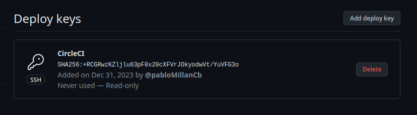
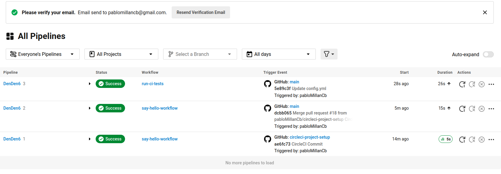
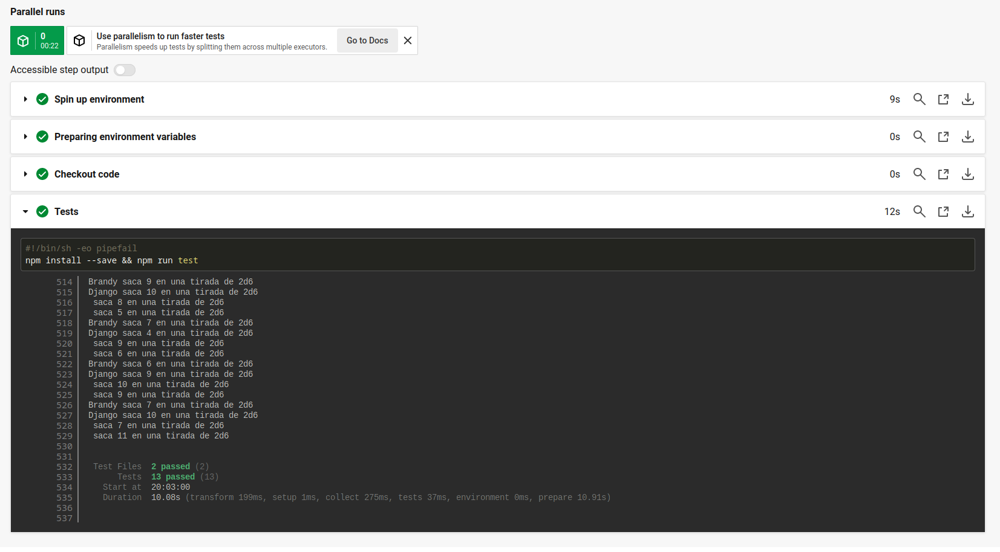

En este hito se configurarán dos vías para la ejecución de los tests definidos en el Hito 2 de forma automática cada vez que se haga un nuevo push al repositorio del proyecto.

## Github Actions

Una de las dos opciones elegidas para la ejecución de los tests fue GitHub Actions. La razón es evidente: ya que el repositorio se encuentra en GitHub, por qué no usar las herramientas que proporciona la plataforma. Además, así se podrá usar fácilmente el mismo contenedor que generamos con el proyecto cada vez que se pushea al repositorio, aprovechando el trabajo desarrollado en el hito anterior.

Para que ejecutasen los tests se creó un nuevo workflow descrito en el siguiente [fichero](https://github.com/pabloMillanCb/DenDen6/blob/main/.github/workflows/run_tests.yml). El fichero se divide en dos partes. Primero, definimos cuándo se ejecutará. Para ello usamos el evento *workflow_run* e indicamos el nombre del workflow creado en el Hito 3, *Publish Docker image*. Esto indicará que cuando termine de ejecutarse ese script y tengamos la imagen generada, actuará este.
```
on:
  workflow_run:
    workflows: ["Publish Docker image"]
    branches: [main]
    types:
      - completed
```
Por otro lado, la propia ejecución de los tests. Con un simple docker run y la dirección del contenedor podemos ejecutarlo.

```
jobs:
  run_test:
    runs-on: ubuntu-latest
    steps:
      - uses: actions/checkout@v2
      - name: Run Tests
        run:
          docker run -t ghcr.io/pablomillancb/denden6:main
```
Un detalle a tener en cuenta fue que, al realizarse los tests, la acción nunca terminaba porque esperaba a que el usuario pulsara 'q' para salir de la interfaz del terminal. Para solucionar esto se modificó el fichero [package.json](https://github.com/pabloMillanCb/DenDen6/blob/main/package.json) para que usara ```vitest run``` en lugar de ```vitest```. De esta forma la ejecución acaba al acabar los tests.

Al realizar un push tendremos el siguiente resultado:


## CircleCI

La segunda herramienta elegida fue CircleCI. Esta es una plataforma para la integración y entrega continua de software para implementar prácticas DevOps. Se eligió ya que es una herramienta muy profesional y usada en el sector. Además, tiene una opción gratuita para empezar a usar sus servicios.

Para configurarlo primero creamos una cuenta y seguimos las instrucciones para conectarlo con nuestro repositorio. Debemos generar una clave *ssh* en nuestro equipo y pegar por un lado la pública en GitHub, en la configuración de nuestro repositorio dentro de la sección *Develop Keys*. Después introducimos la clave privada en CircleCI.



Nos llegará un pull request a nuestro repositorio para añadir un archivo de configuración en la carpeta [.circleci](https://github.com/pabloMillanCb/DenDen6/tree/main/.circleci). Aquí configuramos el workflow a ejecutar cuando el repositorio reciba un push. El archivo quedó de la siguiente forma:

```
# Use the latest 2.1 version of CircleCI pipeline process engine.
# See: https://circleci.com/docs/configuration-reference
version: 2.1

# Define a job to be invoked later in a workflow.
# See: https://circleci.com/docs/configuration-reference/#jobs
jobs:
  test:
    # Specify the execution environment. You can specify an image from Docker Hub or use one of our convenience images from CircleCI's Developer Hub.
    # See: https://circleci.com/docs/configuration-reference/#executor-job
    docker:
      - image: ghcr.io/pablomillancb/denden6:main
    # Add steps to the job
    # See: https://circleci.com/docs/configuration-reference/#steps
    steps:
      - checkout
      - run:
          name: "Tests"
          command: "npm install --save && npm run test"

# Orchestrate jobs using workflows
# See: https://circleci.com/docs/configuration-reference/#workflows
workflows:
  run-ci-tests:
    jobs:
      - test
```

En el panel de CircleCI podemos comprobar que al pushear el nuevo archivo, se han ejecutado los tests sobre nuestro contenedor:


