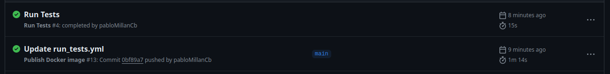
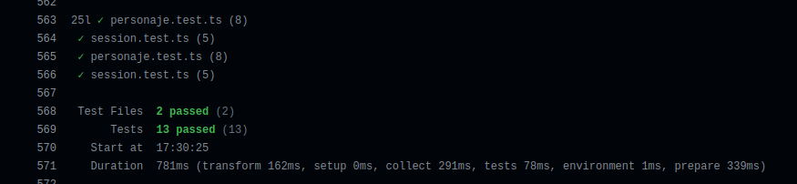

## Github Actions

Una de las dos opciones elegidas para la ejecución de los tests fue GitHub actions. La razón es evidente: ya que el repositorio se encuentra en GitHub, por qué no usar las herramientas que proporciona la plataforma. Además, así se puede usar el mismo contenedor que generamos con el proyecto cada vez que se pushea al repositorio, aprovechando el trabajo desarrollado en el hito anterior.

Para que ejecutasen los tests se creó un nuevo workflow descrito en el siguiente [fichero](https://github.com/pabloMillanCb/DenDen6/blob/main/.github/workflows/run_tests.yml). El fichero se divide en dos partes. Primero, definimos cuándo se ejecutará. Para ello usamos el evento *workflow_run* e indicamos el nombre del workflow creado en el Hito 3, *Publish Docker image*. Esto indicará que cuando termine de ejecutarse ese script y tengamos la imagen generada, actuará este.
```
on:
  workflow_run:
    workflows: ["Publish Docker image"]
    branches: [main]
    types:
      - completed
```
Por otro lado, la propia ejecución de los tests. Con un simple docker run y la dirección del contenedor podemos ejecutarlo.

```
jobs:
  run_test:
    runs-on: ubuntu-latest
    steps:
      - uses: actions/checkout@v2
      - name: Run Tests
        run:
          docker run -t ghcr.io/pablomillancb/denden6:main
```
Un detalle a tener en cuenta fue que, al realizarse los tests, la acción nunca terminaba porque esperaba a que el usuario pulsara 'q' para salir de la interfaz del terminal. Para solucionar esto se modificó el fichero [package.json](https://github.com/pabloMillanCb/DenDen6/blob/main/package.json) para que usara ```vitest run``` en lugar de ```vitest```. De esta forma la ejecución acaba al acabar los tests.

Al realizar un push tendremos el siguiente resultado:




## 