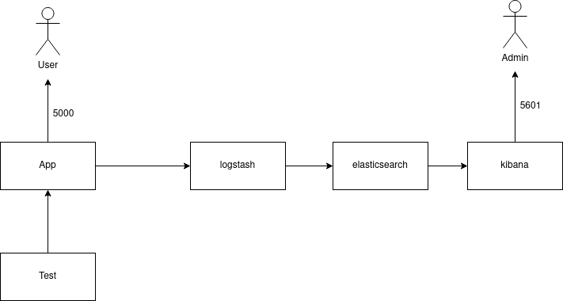

En este hito se creará un docker compose que incluirá varios contenedores como el de nuestro microservicio, tests y logs.

## Creación de Docker Compose

Para configurar docker compose se creó el archivo [docker-compose.yml](). En este se describen los distintos contenedores de los que se compondrá nuestro sistema. Ejecutando los siguientes comandos podemos construir y ejecutar nuestro contenedor:
```
docker compose build .
docker compose up
```
Para cada servicio con el que cuente nuestro compose usaremos una etiqueta. Por ejemplo, para nuestro microservición se empreó `app`. Bajo esta etiqueta especificamos con el parámetro `build` el contexto en el que construiremos el compose y, si se fuera usar algún archivo que no se llamara `Dockerfile` para construir el contenedor, se incluye aquí. Con la etiqueta `ports` indicamos qué puertos expondrá el servicio.

El contenedor de app, por ejemplo, se describiría de la siguiente forma:
```
  app:
    build:
      context: .
    ports:
      - "5000:5000"
```

## Creación de contenedor de tests

Como ya se comentó en el hito anterior, se tuvieron que configurar el docker compose antes de tiempo para poder ejecutar los tests de api. Para ello se creó el archivo [Dockerfile_test](), donde se especifica un contenedor especial para los tests:

```
FROM node:21.4-alpine

WORKDIR /src

COPY package*.json ./

RUN apk add curl && npm install && npm update 

COPY ./ ./

EXPOSE 5050

CMD ["npm", "run", "test"]
```

Teniendo este contenedor y el de app, al ejecutar docker compose los test podrían dar fallidos en el caso en el que el servicio de app tardara más en estar disponible que el de test. Para ello, en el *docker-compose.yml* se definió un healthcheck para el servicio de app. Esta es una forma que tiene el contenedor de comprobar si ha terminado de levantar su servicio y está completamente operativo:
```
healthcheck:
        test: ["CMD", "curl", "-f", "http://localhost:5000"]
        interval: 15s
        timeout: 5s
        retries: 5
```
En este caso, realizamos una petición a localhost. Si el comando se ejecuta con éxito, se considera que está sano el servicio. Por otro lado, se añadió una etiqueta al contenedor de test para que dependiera de *app* bajo la condición de que el healthcheck fuera correcto:
```
depends_on:
      app:
        condition: service_healthy
```

Una vez realizado esto, al ejecutar el siguiente comando se iniciaban los servicios necesarios para ejecutar los tests:

```
docker compose run test
```

Por último restaba modificar los archivos [run_test.yml]() y [config.yml]() para que al realizarse la integración continua emplearan esta nueva forma de ejecutar los tests.

## Creación de contenedor de logs

El contenedor de logs no se pudo desplegar con éxito. Se siguió la documentación inicial y varios tutoriales para desplegar 3 contenedores ELK (Elasticsearch, logstash, Kibana) para la recopilación y gestión de los logs de la aplicación.

Se usaron las imágenes oficiales de estos contenedores y se añadieron al docker-compose de esta forma:

```
  Elasticsearch:
    image: elasticsearch:7.16.2
    container_name: elasticsearch
    restart: always
    volumes:
    - elastic_data:/usr/share/elasticsearch/data/
    environment:
      ES_JAVA_OPTS: "-Xmx256m -Xms256m"
      discovery.type: single-node    
    ports:
    - '9200:9200'
    - '9300:9300'
    networks:
      - elk

  Logstash:
    image: logstash:7.16.2
    container_name: logstash
    restart: always
    volumes:
    - ./logstash/:/logstash_dir
    command: logstash -f ./logstash_pipeline/logstash.conf
    depends_on:
      - Elasticsearch
    ports:
    - '9600:9600'
    environment:
      LS_JAVA_OPTS: "-Xmx256m -Xms256m"    
    networks:
      - elk

  Kibana:
    image: kibana:7.16.2
    container_name: kibana
    restart: always       
    ports:
    - '5601:5601'
    environment:
      - ELASTICSEARCH_URL=http://elasticsearch:9200  
    depends_on:
      - Elasticsearch  
    networks:
      - elk
      
volumes:
  elastic_data: {}

networks:
  elk:
```

Al iniciar el docker compose, se iniciaban los tres contenedores, pero concretamente el de logstash se reiniciaba continuamente por algún tipo de error. No se pudo determinar la naturaleza de este. En internet sugerían que quizás era porque no tenía el archivo de configuración, pero se comprobó que no era así. Este se copiaba con ```command: logstash -f ./logstash_pipeline/logstash.conf``` en la configuración de docker compose.

El diagrama del compose deseado es el siguiente, aunque como se ha comentado, no fue posible implementar los contenedores de logs.

